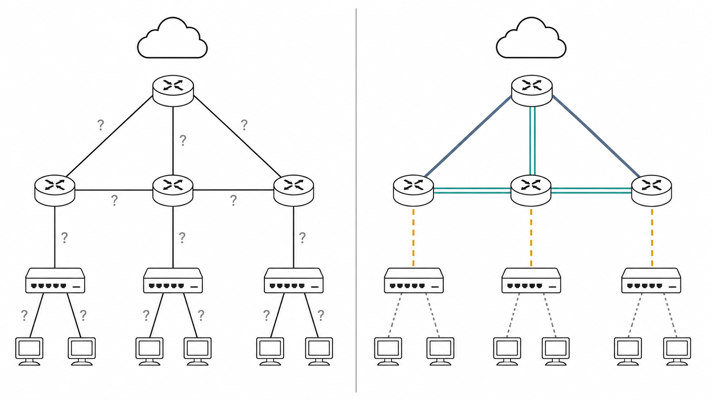
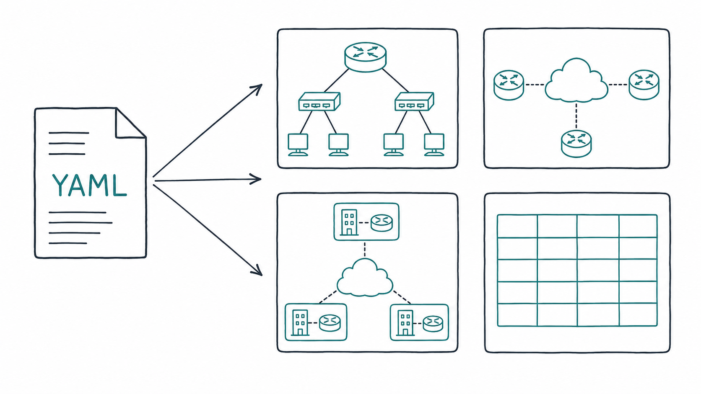
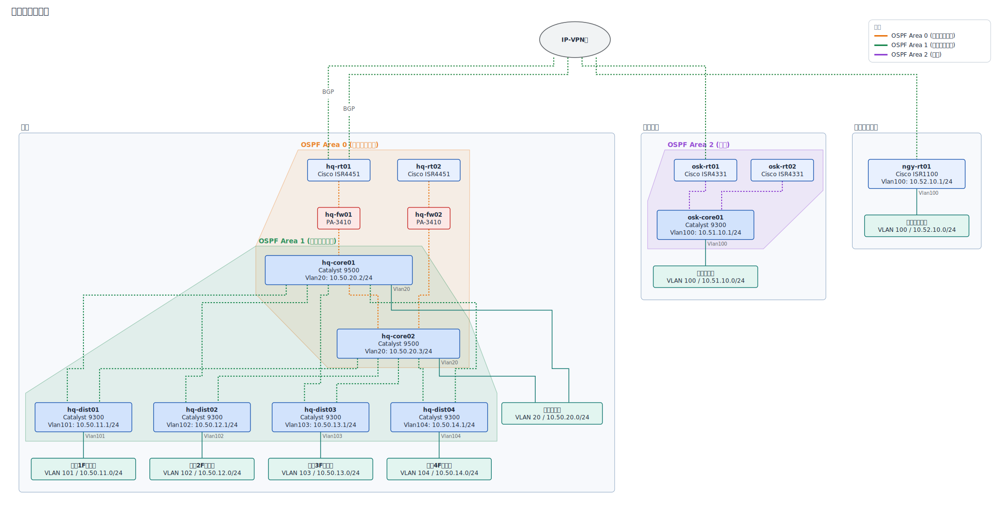
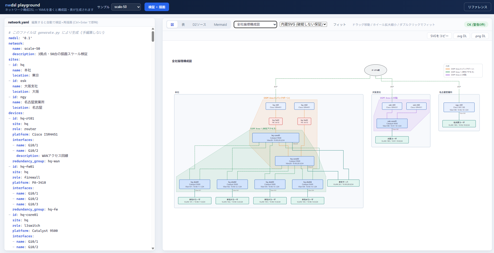

# nwdsl — ネットワーク構成記述 DSL

ネットワーク構成図には、実は「意味」の情報がほとんど入っていない。Visio や drawio の図は箱と線の座標の集まりで、その線が構内の LAN ケーブルなのか、キャリアとの回線契約なのか、BGP の論理隣接なのかは図のどこにも書かれておらず、読み手が文脈から推測している。人間同士なら経験で補えるが、機械には読めない。生成 AI に設計書を書かせたり構成をレビューさせたりする動きが広がるなかで、この「機械に読めない」ことが課題になってきた。

nwdsl は、NW エンジニアが頭の中で区別している構造をそのまま YAML のスキーマにしたものである:

- **物理と論理は別のレイヤ** — `links[].type` で線の意味を4種に型付け(lan-cable / wan-circuit / logical / tunnel)
- **配線と回線契約は別物** — `links`(結線)と `circuits`(契約)を分離
- **トポロジという「事実」と、図という「見せ方」は別** — `views` の宣言で1ソースから物理図・論理図・概要図・経路図を描き分け



この1つのソースから構成図(D2 / Mermaid / 内蔵SVG)と設計書向けの表(Markdown)を生成する(ブラウザで試せる playground も同梱: `nwdsl serve`)。図と表が同一ソースから導出されるため不整合は構造的に発生しない。スキーマとバリデータを持つ構造化記述なので、人間にも AI にも誤解なく読み書きでき、仕様駆動のドキュメント生成の土台になる。



---

## 解決する課題

| 課題 | nwdsl の回答 |
|---|---|
| 構成図は用途別に描き分けが必要(全社概要/拠点詳細/物理/論理)だが、既存ダイアグラムDSLは意味情報を持てない | トポロジ定義(事実)と `views`(見せ方の宣言)を分離。レイヤ選択・拠点フィルタ・拠点畳み込みで1ソースから複数の図を導出 |
| 機器間の「線」には複数の意味がある | `links[].type` で4種を区別: `lan-cable`(構内配線)/ `wan-circuit`(キャリア回線)/ `logical`(論理隣接)/ `tunnel`(オーバーレイ) |
| 回線契約の管理情報が図に埋もれる | NetBox の思想に倣い `circuits`(契約: 事業者・回線番号・帯域・状態)を結線から分離 |
| 図と表の不整合 | 表の「接続先」「回線収容先」も links から導出。手書き二重管理が発生しない |
| 図の配置が意味と一致しない | クラウド起点BFSでエッジを向き付けし「WANが上・LANが下」を構造的に保証([ADR-0005](docs/adr/0005-layout-bfs-orientation.md))。複雑な多段LANでもスケール |
| 正常時/障害時の通信経路を示せない | `paths` にホップ列+プロトコル注記を明示し、経路図(赤太線+ホップ番号、障害✕、迂回表示)を生成([ADR-0006](docs/adr/0006-path-visualization.md)) |
| OSPFエリア等を回線ラベルで表すと実務の描き方と合わない | `domains` でエリア/ゾーンを宣言し、機器・回線を色分け+凡例で表現(内蔵SVGは半透明の面塗りも追加)。DSL側に色を書かせない |
| BGP等のピアリングを論理図に描くと網(IP-VPN等)がどこにも現れない | `links[].via` でクラウドを経由させ、「網の雲を通る線」として2分割描画。論理図でも下層の伝送路が見える |
| 論理構成図にすると孤立して見える機器が出る | L3情報(IPv4/セグメント)を持たない機器はビューの性質(`show_l3`)に応じて自動的に除外し、意味のある機器だけを表示 |
| セグメント配下の端末(サーバ等)がどこにいるか論理図で分からない | `role: server` かつ単一セグメント参照の機器は、セグメントの箱の中に入れ子で描画(D2エンジン、[ADR-0009](docs/adr/0009-segment-nesting.md)) |

---

## サンプル出力

`examples/sample-corp/network.yaml`(3拠点 + IP-VPN + インターネットVPNバックアップ + HSRP冗長)からの生成例:

**全社物理構成図**


**全社WAN概要図** (`collapse_sites`)


**全社論理構成図**


**本社詳細図** (`include_sites`)


**通信経路図 正常時** (`type: path`)


**通信経路図 IP-VPN障害時** (`failure` + `fallback_of`)


生成された表: [examples/sample-corp/generated/tables.md](examples/sample-corp/generated/tables.md)

### 描画エンジン比較: OSPFエリア表示

`examples/scale-50`(3拠点50台)の全社論理構成図。同じYAMLの`domains`定義から、D2は色分け+エリア名ラベル、内蔵SVGは色分け+半透明の面塗り+凡例で表現する。

**D2 (ELK)**


**内蔵SVG**


### 大規模パターン: 20拠点ハブ&スポーク

`examples/branch-20`(20拠点44台、東西DRハブ+モバイル閉域網バックアップ)のWAN概要図(`collapse_sites`)。拠点数が増えるとD2(ELK)は横に間延びしていく一方、内蔵SVGは不変条件(重なりゼロ)を保ったままコンパクトに収まる([ADR-0007](docs/adr/0007-renderer-strategy.md))。

**D2 (ELK)**


**内蔵SVG**


> **描画エンジンは3系統**(D2 / Mermaid / 内蔵SVG)。D2(ELK)は木構造系の構成で最も美しいが、leaf-spineファブリック・メトロリング・10拠点超のWAN概要では破綻する([ADR-0007](docs/adr/0007-renderer-strategy.md)、[examples/stress/](examples/stress/) で再現可能)。このため**「どのパターンでも破綻しない」ことを不変条件(ノード/ラベル重なりゼロ・線のノード貫通ゼロ)として保証する内蔵SVGエンジン**を実装している(`--format svg`、[ADR-0008](docs/adr/0008-invariant-renderer.md))。内蔵エンジンはリングを円環に、ファブリックを2段扇状に自動配置し、全サンプル×全ビューの不変条件をテストで機械検証している。D2のバイナリすら不要(標準ライブラリのみで動作)なので、playgroundは追加インストールなしでこのエンジンを既定にしている。同様に、拠点の左右順序も**D2(ELK)はクロス最小化ヒューリスティック任せで保証できない一方、内蔵SVGは`views[].order: declared`でsites宣言順に固定できる**(見た目最適化 vs 一貫性、の使い分け。[ADR-0005 補遺3](docs/adr/0005-layout-bfs-orientation.md)、`examples/sample-corp`で実演)。

---

## クイックスタート

**[uv](https://docs.astral.sh/uv/) の場合**

```powershell
uv sync                              # .venv作成 + 依存関係インストール
.\scripts\install_d2.ps1             # 任意: D2(ELK)によるSVGコンパイルを使いたい場合のみ (無くても内蔵SVGエンジンで動く)

uv run nwdsl serve                                              # ブラウザで試す (playground)
uv run nwdsl validate examples\sample-corp\network.yaml         # 整合性検査
uv run nwdsl render   examples\sample-corp\network.yaml -o out  # 図ソース生成 (.d2 / .mmd)
uv run nwdsl tables   examples\sample-corp\network.yaml -o out\tables.md
uv run nwdsl schema   -o nwdsl.schema.json                      # エディタ補完用 JSON Schema
```

**pip の場合**

```powershell
python -m venv .venv
.\.venv\Scripts\pip install -e .
.\.venv\Scripts\Activate.ps1         # これで以降 nwdsl コマンドがそのまま通る (実行ポリシーで弾かれる場合は下記参照)
.\scripts\install_d2.ps1             # 任意: D2(ELK)によるSVGコンパイルを使いたい場合のみ (無くても内蔵SVGエンジンで動く)

nwdsl serve                                              # ブラウザで試す (playground)
nwdsl validate examples\sample-corp\network.yaml         # 整合性検査
nwdsl render   examples\sample-corp\network.yaml -o out  # 図ソース生成 (.d2 / .mmd)
nwdsl tables   examples\sample-corp\network.yaml -o out\tables.md
nwdsl schema   -o nwdsl.schema.json                      # エディタ補完用 JSON Schema
```

`pip install -e .` だけでは `.venv\Scripts` にPATHが通らず `nwdsl` コマンドが見つからない(`Activate.ps1` の実行が必要)。実行ポリシーで `Activate.ps1` 自体が弾かれる場合は、activateせず毎回 `.\.venv\Scripts\nwdsl.exe` とフルパスで呼ぶ(例: `.\.venv\Scripts\nwdsl.exe serve`)。

`nwdsl serve` は http://127.0.0.1:8321/ にローカルの playground(標準ライブラリのみ、127.0.0.1限定)を起動する。左ペインの YAML を編集すると自動で検証+描画され、以下がブラウザ内だけで完結する。初見の人はまずこれ。

- サンプル読み込み(最小構成〜50台規模、7種)とビュー切替
- 描画エンジン切替(自動 / D2 / Mermaid / 内蔵SVG)、パン(ドラッグ)+ズーム(ホイール)
- 表 / D2ソース / Mermaidソース / SVG それぞれのコピー・ダウンロード
- YAML editor のシンタックスハイライト、左右ペイン幅のドラッグ調整
- チュートリアル・リファレンス・パターン集・FAQ・ADR の閲覧(各ページに Markdown をそのままコピーするボタンあり。AIに読み込ませる用途を想定)



SVG 化には [D2](https://github.com/terrastruct/d2/releases)(単一バイナリ)を使う。`.\scripts\install_d2.ps1` 済みなら `.tools\` から自動検出される(`nwdsl serve` 経由)ので、CLIから直接呼ぶ場合だけ以下のようにパスを指定する:

```powershell
.\.tools\d2-v0.7.1\bin\d2.exe --layout=elk out\physical-all.d2 out\physical-all.svg
# PATHが通ったD2を別途インストール済みなら: d2 --layout=elk out\physical-all.d2 out\physical-all.svg
```

Mermaid 出力(.mmd)は GitHub / Obsidian にそのまま貼れる。詳細図は D2、概要図・埋め込みは Mermaid の使い分けを推奨。

---

## 記述例(抜粋)

```yaml
nwdsl: "0.1"
network: {name: sample-corp}

sites:
  - {id: hq, name: 本社}
  - {id: osk, name: 大阪支店}

devices:
  - id: hq-rt01
    site: hq
    role: router
    platform: Cisco ISR4331
    interfaces:
      - {name: Gi0/0/0, description: IP-VPNアクセス回線}

clouds:
  - {id: ipvpn, name: NTT Com IP-VPN網, kind: wan}

circuits:
  - {id: cct-ipvpn-hq, provider: NTTコミュニケーションズ, service: IP-VPN, bandwidth: 100M}

links:
  - type: wan-circuit                       # 線の意味を必ず宣言する
    endpoints: ["hq-rt01:Gi0/0/0", "ipvpn"] # 契約(circuits)と結線(links)は分離
    circuit: cct-ipvpn-hq

views:
  - id: wan-overview
    title: 全社WAN概要図
    layers: [wan-circuit, tunnel]
    collapse_sites: true                    # 拠点を1ノードに畳む
```

OSPFエリア色分けと、論理図でのBGPピアリングの網経由描画:

```yaml
domains:
  - {id: area0, name: "OSPF Area 0 (バックボーン)"}
  - {id: area1, name: "OSPF Area 1 (本社アクセス)"}

links:
  - {type: logical, endpoints: ["hq-rt01", "dc-rt01"], domain: area0, description: OSPF}
  - {type: logical, endpoints: ["dc-rt01", "aws-vgw01"], via: ipvpn, description: BGP}
```

---

## サンプル一覧 (playgroundのサンプル選択にも表示される)

| サンプル | 規模 | 見どころ |
|---|---|---|
| [two-site-ipsec](examples/two-site-ipsec/) | 2拠点4台 | 最小実務構成 (フレッツ+IPsecのみ、ヤマハ機、静的経路) |
| [sample-corp](examples/sample-corp/) | 3拠点10台 | 標準サンプル (IP-VPN+VPNバックアップ+HSRP+正常/障害経路+セグメント内包表示) |
| [hq-dc-cloud](examples/hq-dc-cloud/) | 3拠点13台 | ハイブリッド構成 (広域Ether+AWS Direct Connect+VPNバックアップ、DX障害経路) |
| [complex-lan](examples/complex-lan/) | 2拠点19台 | 多段LAN (FW/コア冗長→ディストリ→アクセス、DMZ) |
| [branch-20](examples/branch-20/) | 20拠点44台 | 多拠点ハブ&スポーク (東西DRハブ+モバイル閉域網バックアップ)。概要図は内蔵SVG推奨 |
| [scale-50](examples/scale-50/) | 3拠点50台 | 規模検証 (本社29台の多段構成) |
| [stress/](examples/stress/) | 合成4種 | 描画エンジンの限界検証 (leaf-spine/リング/多拠点/LAG) |

---

## ドキュメント

- [チュートリアル](docs/tutorial.md) — 最小構成から30分で(全ステップ実機検証済み)
- [リファレンス](docs/reference.md) — 全フィールド・バリデーション規則・CLI
- [実務パターン集](docs/patterns.md) — 冗長構成・網接続・専用線・DMZ・OSPFエリア等10パターンの書き方
- [FAQ](docs/faq.md) — エラーコード対処表 + よくある質問
- [OpenSpec 統合ガイド](docs/openspec-integration.md) — 仕様駆動ドキュメント生成への組み込み
- [設計判断記録 (ADR)](docs/adr/) — 先行事例調査、新DSL策定の判断、スキーマ設計の根拠、レンダラ戦略
- [調査ログ](docs/notes/phase0-survey-log.md) — 検討過程の記録

playground内の各ドキュメントページには、内容をそのまま Markdown でコピーするボタンがある(AIにコンテキストとして読み込ませる用途)。

---

## リポジトリ構成

```
src/nwdsl/
  model.py            # スキーマ定義 (pydantic, 単一ソース)
  validate.py         # 意味的整合性検査
  graph.py            # ビュー解決・向き付け・レイヤ/domains/via/経路のロジック (フォーマット非依存の中間表現)
  render_d2.py / render_mermaid.py / render_svg.py  # 3系統の描画エンジン
  svg_layout.py       # 内蔵SVGのレイアウトエンジン (Sugiyama法 + 不変条件保証)
  tables.py           # Markdown表生成
  webapp.py + static/playground.html  # ローカルplayground (`nwdsl serve`)
  cli.py
tests/              # pytest (サンプル正常系 + 異常系 + レイアウト不変条件 + examples鮮度検証)
examples/           # 7サンプル(2〜50台規模) + stress/(描画エンジン限界検証)
scripts/regen_examples.py  # examples配下の全成果物 (d2/mmd/tables/内蔵SVG/D2コンパイル済みSVG) を一括再生成
scripts/install_d2.ps1     # D2バイナリを .tools/ に取得 (Windows、任意)
schema/nwdsl.schema.json
docs/               # チュートリアル・リファレンス・パターン集・FAQ・ADR
```

`graph.py` やレンダラを変更したら、コミット前に必ず `python scripts/regen_examples.py` を実行して `examples/` の成果物(README埋め込み画像を含む)を再生成すること。`tests/test_examples_fresh.py` が再生成漏れを検出する(D2コンパイル済みSVGの検証はD2バイナリがある場合のみ)。

---

## 動作環境

- Python 3.11+ (pydantic v2, PyYAML)。追加インストールなしで内蔵SVGエンジン・playgroundが使える
- D2/Mermaid出力をSVG化する場合のみ [D2](https://github.com/terrastruct/d2/releases) v0.7+ (dagre/ELK同梱の単一バイナリ) が別途必要。Windowsは `.\scripts\install_d2.ps1` で `.tools\` に取得できる(`.gitignore`対象なのでclone直後は各自実行する)

---

## ライセンス

[MIT](LICENSE)
